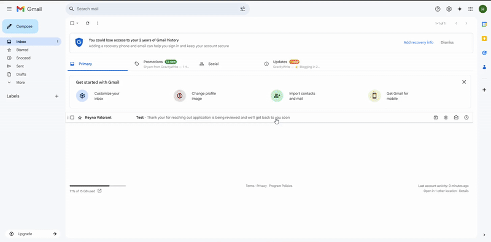

# Email Writer Extension - AI Powered Email Reply Generator


## Overview

The Email Writer Extension is a powerful tool that integrates with Gmail to help you quickly generate professional email replies using AI. With a simple click, you can create well-crafted responses tailored to your preferred tone.

## Features

- **One-click AI replies**: Generate email responses instantly
- **Tone customization**: Choose from Professional, Friendly, Casual, or Enthusiastic tones
- **Seamless Gmail integration**: Works directly in your Gmail compose window
- **Fast response times**: Powered by Gemini API for high-quality responses



## Installation

### Prerequisites
- Java 17 or higher
- Maven
- Chrome or any Chromium-based browser

### Backend Setup
1. Clone this repository
2. Configure your `application.properties` with your Gemini API credentials:
   ```properties
   gemini.api.url=YOUR_GEMINI_API_URL
   gemini.api.key=YOUR_GEMINI_API_KEY
   ```
3. Build and run the Spring Boot application:
   ```bash
   mvn spring-boot:run
   ```

### Chrome Extension Setup
1. Open Chrome and navigate to `chrome://extensions`
2. Enable "Developer mode"
3. Click "Load unpacked" and select the extension directory
4. The extension will now be available in your Gmail interface

## Usage

1. Open an email in Gmail that you want to reply to
2. Click the "Reply" button as normal
3. In the compose toolbar, you'll see the new "AI Reply" button and tone selector
4. Select your desired tone (default is Professional)
5. Click "AI Reply" to generate your response
6. The generated reply will be inserted into your compose window


## Configuration

You can customize the following in `application.properties`:
- Server port (default: 8080)
- Gemini API endpoint
- Response timeout settings

## Troubleshooting

If you encounter issues:
- Verify the backend service is running (`http://localhost:8080`)
- Check your API key is valid
- Ensure you're using the extension in Gmail (not other email providers)
- Refresh the Gmail page if the button doesn't appear

## Contributing

Contributions are welcome! Please open an issue or pull request for any improvements.

